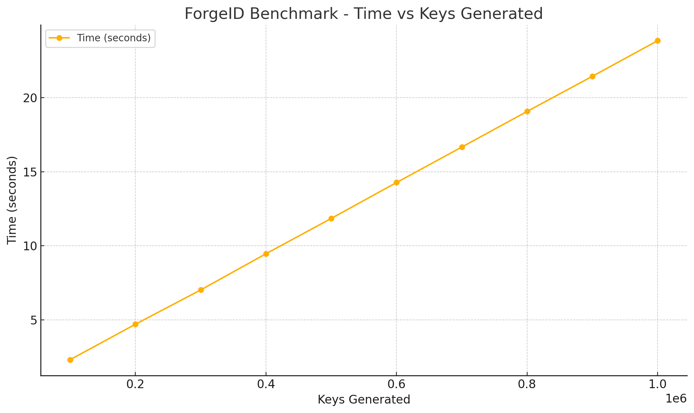
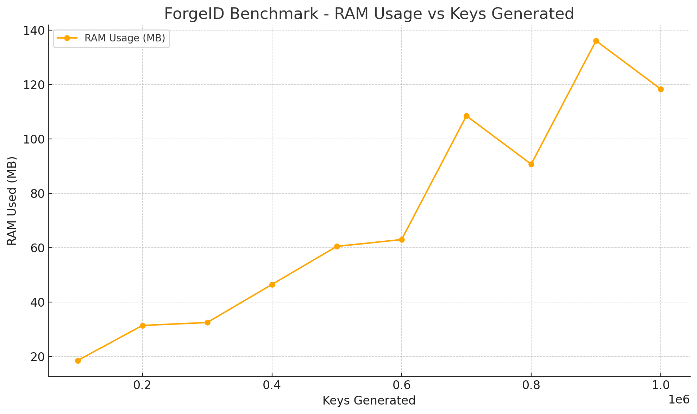

# 🔐 ForgeID

A scalable, secure, and verifiable unique ID generator for Node.js.  
Designed to evolve with time and prevent collisions for decades — even millennia.

[](https://www.npmjs.com/package/forgeid)
[](LICENSE)
[](#)
[](webpack.config.js)

---

## ✨ Features

- ✅ Cryptographically signed (HMAC SHA-256)
- 🧆 Unique and verifiable
- 🕰️ ID length grows over time
- 🔐 Includes timestamp + device fingerprint
- 🧪 Built-in validation and stress testing
- 🩸 Zero dependency (only uses `crypto` and `os`)
- 🎨 Supports prefix and formatting (`dash`, `space`)

---

## 🚀 Installation

```bash
npm install forgeid
```

---

## 🔧 Basic Usage

```js
const ForgeID = require('forgeid')
const forge = new ForgeID('your-secret')

const id = forge.generate()
console.log('ID:', id)

const isValid = forge.verify(id)
console.log('Verified:', isValid)
```

---

## 🎨 With Prefix & Format

```js
forge.generate('TRX')                // TRX-abc123xyz...
forge.generate('ORD', 'dash')        // ORD-abc123-def456...
forge.generate('REF', 'space')       // REF abc123 def456...
```

---

## 📀 ID Structure

Each ID includes:
- Random entropy from `crypto.randomBytes`
- Host fingerprint (`hostname + MAC`)
- Base36 timestamp (`Date.now()`)
- Signature from HMAC (last 10 characters)

ID format is:
```
[prefix-]baseContent + signature
```

Length increases over time:
```
length = baseLength + floor((currentYear - startYear) / intervalYears)
```

---

## 🧪 Stress Test

```js
const forge = new ForgeID('your-secret')
forge.stressTest(1e6, 1e5)
```

Tests 1 million IDs for:
- Duplicate collision
- HMAC signature validity

---

## 🗒️ API

```ts
new ForgeID(secret?: string, startYear?: number, baseLength?: number, intervalYears?: number)

forge.generate(prefix?: string, format?: 'dash' | 'space' | ''): string

forge.verify(id: string): boolean

forge.format(id: string, style?: 'dash' | 'space' | ''): string

forge.stressTest(total?: number, step?: number): void
```

---

## ✅ Unit Testing

```bash
npm install --save-dev mocha chai
npm test
```

Test cases cover:
- Raw ID generation & verification
- Formatted and prefixed IDs
- Tampered/invalid inputs
- Collision-free generation (10K+)

---

## 🧠 TypeScript Support

```ts
import ForgeID from 'forgeid'

const forge = new ForgeID()
const id: string = forge.generate('TRX', 'dash')
const isValid: boolean = forge.verify(id)
```

Types are defined in `forgeid.d.ts`.

---

## 📆 Build

```bash
npm run build
```

Produces:

- `dist/forgeid.min.js` → minified bundle  
- `dist/forgeid.d.ts` → TypeScript definitions

---

## 📊 Benchmark

ForgeID can generate 1 million unique, verifiable IDs in under 25 seconds with zero duplicates.

### ⏱️ Time vs Keys Generated


### 🧠 RAM Usage vs Keys Generated


<sub>Tested on macOS + Node.js v24.2.0, M3 CPU.</sub>

---

## 📁 Project Structure

```
ForgeID/
├── src/              → main ForgeID logic (ES5)
├── dist/             → minified + .d.ts output (for publishing)
├── test/             → unit tests
├── benchmark/        → benchmark script, JSON & PNG chart
```

---

## 📄 License

MIT © [NeaByteLab](https://github.com/NeaByteLab)